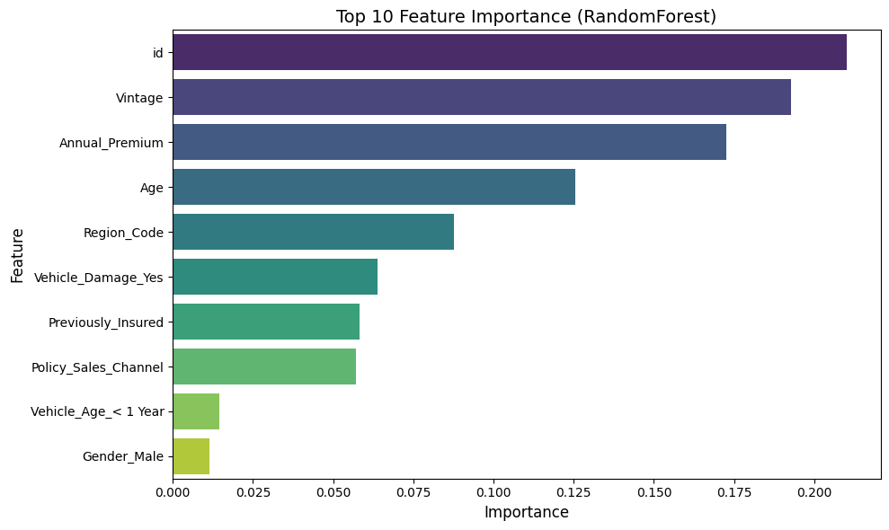
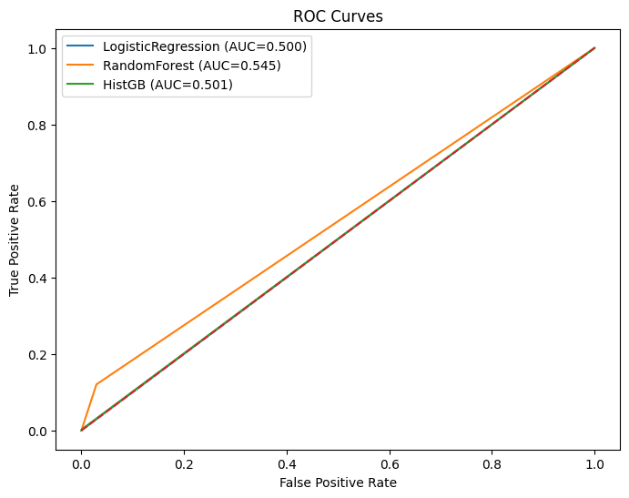
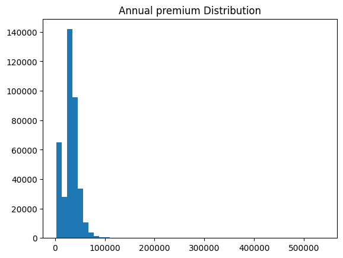

# Sentiment Analysis using Machine Learning
A Machine Learning project that analyzes text sentiment and predicts whether the sentiment is Positive, Negative, or Neutral using Natural Language Processing techniques.
## 🚀 PROJECT OVERVIEW
This project is a Machine Learning based Sentiment Analysis system that classifies text into:
- Positive
- Negative
- Neutral

## 🛠️ Technologies Used
- Python
- Pandas
- NumPy
- Scikit-learn
- NLP
- Jupyter Notebook

## 📌 Feature
- Text preprocessing
- Sentiment classification
- Machine learning model training
- Prediction system

## 📊 Project Workflow
1. Data Collection
2. Data Preprocessing
3. Feature Extraction
4. Model Training
5. Sentiment Prediction
# Model_output

# ROC Curve

# Feature Importance

# Target Distribution

# Annual Premium Distribution

## Output
The model predicts whether a sentence is positive, negative, or neutral.

## Example Predictions

| Input Text | Prediction |
|------------|------------|
| "This movie is amazing" | Positive |
| "Worst experience ever" | Negative |
| "The product is okay" | Neutral |

## Author
Harish
